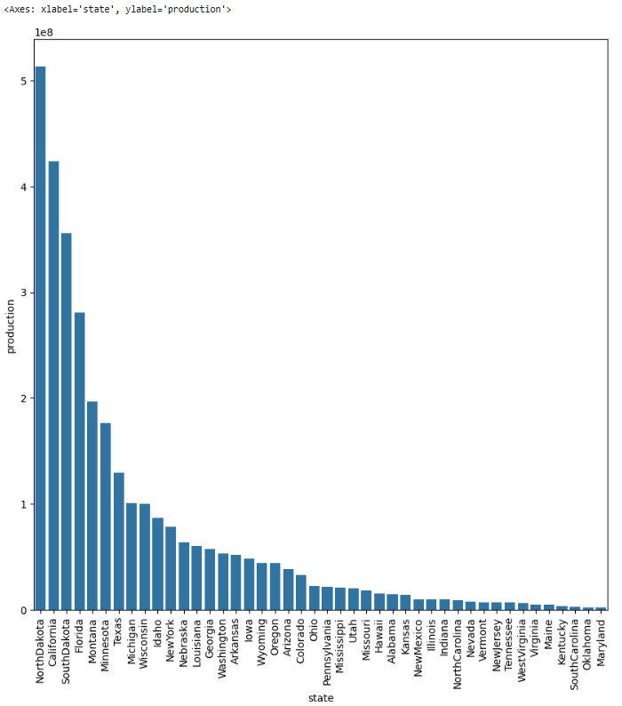
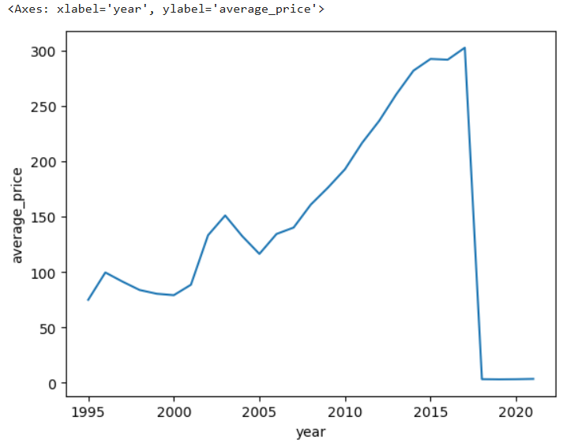
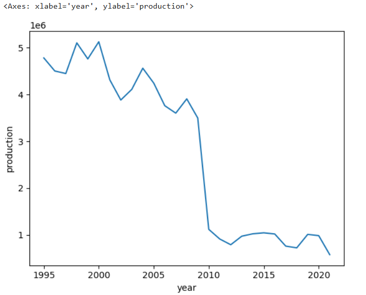
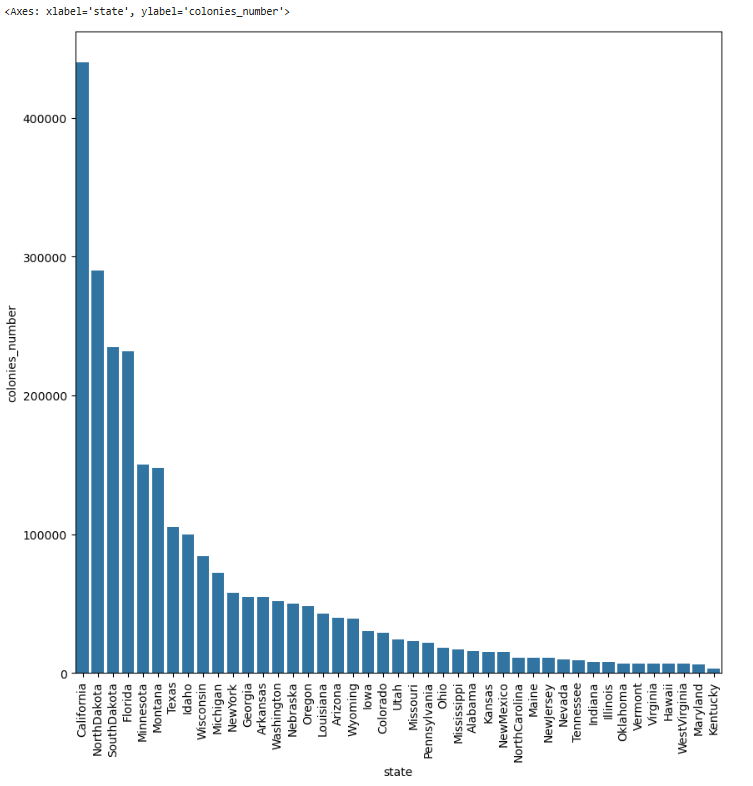
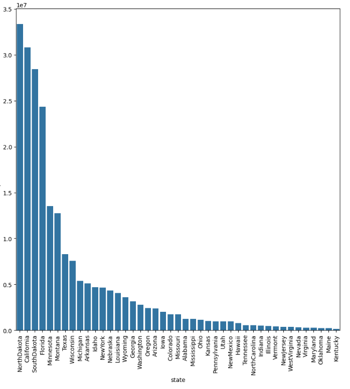

# US-Honey-Production-Case-Study

## Project Overview

This project analyzes honey production data across the United States from 1995 to 2021. The dataset contains information about bee colonies, honey production, pricing, and economic value across all states.

## Dataset Description

The dataset `US_honey_dataset.csv` contains 1,115 rows and 9 columns:

- **Unnamed: 0**: Index column (not relevant for analysis)
- **state**: US state name
- **colonies_number**: Number of honey bee colonies
- **yield_per_colony**: Average honey produced per colony (in pounds)
- **production**: Total honey production in pounds
- **stocks**: Amount of honey held in stock (in pounds)
- **average_price**: Average price per pound (in cents/dollars)
- **value_of_production**: Total monetary value of honey produced (in dollars)
- **year**: Data collection year (1995-2021)

## Project Structure

The analysis is organized into the following sections:

1. Importing Libraries
2. Importing Dataset
3. Exploratory Data Analysis (EDA)
4. States vs Production Analysis
5. Analysis of Average Price of Honey with respect to Year
6. Analysis of Production with respect to Year
7. Analyzing Year 2000
8. Inferences

## Notebook Sections

### 1. Importing Libraries

This section imports all necessary Python libraries for data analysis and visualization:
- pandas for data manipulation
- numpy for numerical operations
- matplotlib and seaborn for visualization
- plotly for interactive visualizations

### 2. Importing Dataset

This section loads the US honey dataset and displays basic information:
- Initial view of the data
- Dataset shape and structure
- Summary statistics

### 3. Exploratory Data Analysis (EDA)

This section explores the data distribution and relationships between variables:
- Distribution of colonies across states
- Distribution of production values
- Correlation between variables
- Yearly trends for key metrics

### 4. States vs Production Analysis

This section analyzes honey production across different states:
- Top honey-producing states over the entire period
- Visualization of production by state
- Analysis confirming North Dakota (513,742,000 pounds), California (423,876,000 pounds), South Dakota (355,726,000 pounds), Florida (280,934,000 pounds), and Montana (197,173,000 pounds) as the top 5 producers

### 5. Analysis of Average Price of Honey with respect to Year

This section examines honey price trends over time:
- Visualization of average price changes from 1995-2021
- Price increase from 1995 to 2015
- Price trends post-2016, noting the unit change in the dataset
- Year-to-year price volatility analysis

### 6. Analysis of Production with respect to Year

This section investigates honey production trends over time:
- Visualization of production changes from 1995-2021
- Analysis of the significant production drop after 2010
- Comparison of pre-2010 and post-2010 production levels

### 7. Analyzing Year 2000

This section focuses specifically on honey production in the year 2000:
- Comparison of California and North Dakota in 2000
- Analysis confirming California had high colony numbers (440,000) in 2000

- Comparison showing North Dakota had higher production (33,350,000 pounds) than California (30,800,000 pounds) despite having fewer colonies

### 8. Inferences

Key findings from the analysis:
- California had the highest number of colonies in 2000 (440,000)
- North Dakota produced more honey than California in 2000 despite having fewer colonies
- Average price of honey showed an upward trend from 1995 to 2017, with a unit change in recording after 2017
- Honey production significantly dropped after 2010
- The top 5 honey-producing states over the entire period are:
  1. North Dakota: 513,742,000 pounds
  2. California: 423,876,000 pounds
  3. South Dakota: 355,726,000 pounds
  4. Florida: 280,934,000 pounds
  5. Montana: 197,173,000 pounds

## Running the Project

To run this analysis:

1. Ensure you have Jupyter Notebook or JupyterLab installed
2. Install required libraries: `pip install pandas numpy matplotlib seaborn plotly`
3. Download the dataset `US_honey_dataset.csv`
4. Open the notebook and run each cell sequentially

## Conclusion

This analysis provides insights into honey production trends across the United States, highlighting regional production leaders, production trends over time, and pricing patterns. The significant drop in honey production after 2010 warrants further investigation into potential causes such as colony collapse disorder, changing agricultural practices, or climate factors.
